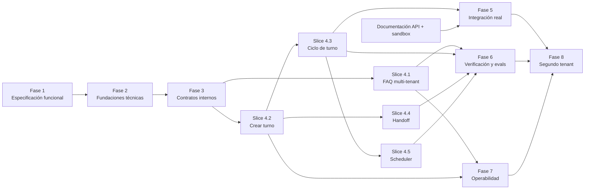

# Roadmap maestro

**Estado:** ready  
**Objetivo:** ordenar entregas verticales, dependencias, paralelización y gates del MVP.

## Mapa de fases

## Estrategia de entrega

La arquitectura y los contratos se estabilizan primero. A continuación se implementan slices completas. Testing, seguridad y observabilidad acompañan cada tarea; las fases 6 y 7 consolidan evidencia transversal y capacidades operativas, no introducen esas disciplinas por primera vez.

## Waves de trabajo

| Wave | Trabajo | Dependencia | Hito demostrable |
|---|---|---|---|
| W0 | Fase 1: dominio, requisitos y aceptación | Plan maestro | Backlog verificable y sin ambigüedades críticas |
| W1 | Fase 2: arquitectura, datos, amenazas y ADRs | W0 aceptada | Diseño coherente y revisado |
| W2 | Fase 3: contratos, errores, tools y fakes | W1 aceptada | Contract tests ejecutables |
| W3 | Slice 4.1 y base de Slice 4.2 | W2 aceptada | FAQ aislada y workflow de alta con mock |
| W4 | Slices 4.3 y 4.4 | Slice 4.2 aceptada | Ciclo de turnos y handoff |
| W5 | Slice 4.5, pruebas de resiliencia y operabilidad | W4 integrada | Recordatorios y reconstrucción de runs |
| W6 | Fase 5 cuando se cumpla `EXT-001`; en paralelo Fases 6 y 7 | MVP técnico integrado | Sandbox real y suite de readiness |
| W7-prep | Fase 8 package/provision disabled | Fase 4 aceptada | Segundo package validado sin activar |
| W7-activate | Fase 8 preflight/activación/prueba final | Fases 5, 6 y 7 aceptadas | Segundo tenant sin cambios específicos en Core |

## Gates globales

### G0 — Requisitos listos

- actores y UC-01 a UC-10 definidos;
- RF, RNF, BR, CON y EXT identificados;
- criterios de aceptación observables;
- datos desconocidos clasificados.

### G1 — Arquitectura lista

- componentes y ownership definidos;
- modelo de datos y límites transaccionales definidos;
- tenant context obligatorio en toda interfaz sensible;
- amenazas críticas con mitigación;
- ADRs fundacionales aceptados.

### G2 — Contratos listos

- modelos canónicos versionados;
- errores tipados;
- tools allowlisted por tenant;
- fakes y contract tests compartidos;
- compatibilidad documentada.

### G3 — Slice lista

- criterios de la slice pasan;
- pruebas negativas multi-tenant pasan;
- trazas y auditoría correlacionables;
- fallos y duplicados cubiertos;
- documentación y evidencia actualizadas.

### G4 — Integración real lista

G4 es el gate de salida de Fase 5. Su entrada requiere G2, las Slices 4.2–4.3 aceptadas y las dependencias externas indicadas.

- `EXT-001`, `EXT-002` y `EXT-003` satisfechos;
- contract tests contra adaptador real;
- sandbox end-to-end;
- secretos fuera del modelo y del repositorio;
- rollout y rollback ensayados.

### G5 — MVP listo

- Definition of Done del MVP satisfecha;
- suites funcional, seguridad, aislamiento, resiliencia y evals aceptadas;
- SLOs y alertas operables;
- segundo tenant incorporado sin lógica específica en Core.

## Política de replanificación

Se actualiza el roadmap cuando cambia un contrato compartido, aparece una nueva dependencia bloqueante, falla un gate por diseño o una tarea supera su boundary. La replanificación debe preservar identificadores existentes y marcar como `superseded` lo reemplazado.

## Camino crítico

Fase 1 → Fase 2 → Fase 3 → Slice 4.2 → Slice 4.3 → Fase 5 → Fase 8.

La Fase 5 puede permanecer bloqueada sin impedir validar el MVP contra mocks. No puede considerarse lista para producción sin documentación oficial y sandbox.
