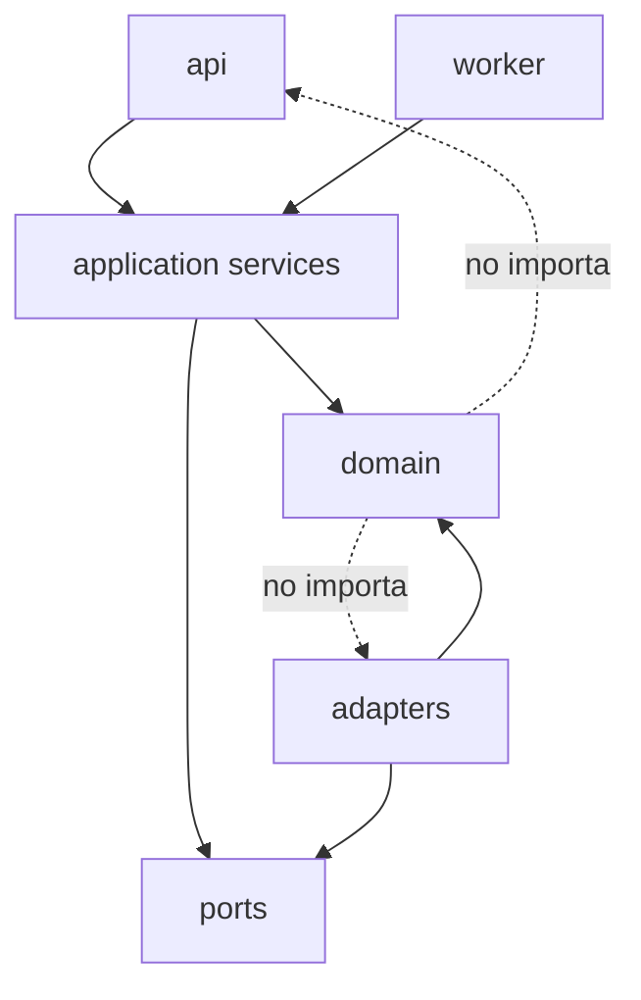

# Modelo de componentes

**Estado:** ready  
**TDD:** `system-tdd.md`

## Componentes y ownership

| Componente | Responsabilidad única | Consume | Produce | Persistencia |
|---|---|---|---|---|
| Channel Gateway | Verificar, normalizar y entregar mensajes | Webhook/provider | `InboundMessage`, `DeliveryResult` | Dedupe de mensajes |
| Tenant Resolver | Mapear canal/cuenta a tenant activo | Channel account | `TenantContext` parcial | Tenant/integration |
| Config Repository | Versionar, publicar y resolver configuración | Tenant | `TenantConfig` | TenantConfig |
| Conversation Service | Estado de ownership e historial | Mensajes | Conversation snapshot | Conversation/Message |
| Agent Harness | Orquestar un turno conversacional | Contexto, skills, LLM | `AgentTurnResult` | AgentRun |
| Intent Router | Seleccionar skill/fallback permitido | Mensaje + config | `SkillName` | No |
| Context Compiler | Minimizar y ensamblar contexto | Políticas, memoria, KB, tools | `CompiledContext` | No |
| LLM Port | Adaptar proveedor de modelo | Prompt estructurado | `ModelResult` | Usage en run |
| Skill Registry | Registrar y autorizar capacidades | Config | Instancias de Skill | No |
| FAQ Skill | Resolver consulta informativa | KB + LLM | Respuesta con fuentes | No |
| Appointment Skill | Traducir conversación a comandos | Estado + workflow | Pregunta/resultado | Workflow |
| Knowledge Service | Ingestar y recuperar conocimiento | Objetos + embeddings | Hits con procedencia | Document/chunk/vector |
| Workflow Engine | Controlar estados y side effects | Commands | `WorkflowResult` | WorkflowExecution |
| MCP Resolver | Seleccionar servidor/capacidad por tenant | Config + integration | `McpTarget` | Integration |
| MCP Client | Invocar tool con política común | Target + ToolCall | `ToolResult` | ToolExecution |
| MCP Platform | Reutilizar contratos/auth/audit | Capabilities/adapters | Tools MCP | Audit |
| Institutional Adapter | Traducir a API confirmada | Contrato canónico | Contrato canónico | No autoritativa |
| Handoff Service | Transferir ownership y contexto | Conversation/workflow | `HandoffResult` | Handoff |
| Scheduler | Crear y despachar jobs durables | Appointment events | Reminder command | ScheduledJob/outbox |
| Audit Service | Registrar eventos estructurados | Eventos de dominio | AuditEvent | AuditEvent |
| Telemetry | Emitir trazas, métricas y logs | Spans/events | Backend OTel | Externa |

## Dependencias permitidas



Reglas:

- dominio no importa FastAPI, SQLAlchemy, Redis ni SDKs externos;
- application services coordinan puertos y dominio;
- adapters implementan puertos;
- API transforma transporte a comandos y resultados;
- ningún módulo accede a tablas propiedad de otro módulo sin repositorio público;
- eventos de dominio no contienen secretos ni objetos SDK.

## Interfaces críticas

### Repositorios tenant-scoped

```python
class TenantScopedRepository(Protocol):
    async def get(self, tenant: TenantContext, entity_id: UUID) -> Entity: ...
```

No se admiten overloads sin tenant. Para tareas administrativas cross-tenant existe un puerto separado, autenticado como plataforma y no reutilizable por el Agent Harness.

### Tool execution

```python
class ToolExecutor(Protocol):
    async def execute(
        self,
        tenant: TenantContext,
        run_id: UUID,
        call: ToolCall,
    ) -> ToolResult: ...
```

El executor vuelve a validar allowlist aunque el modelo haya recibido una lista filtrada.

### Auditoría

```python
class AuditSink(Protocol):
    async def append(self, tenant: TenantContext, event: AuditEvent) -> None: ...
```

Audit events son append-only desde la aplicación; correcciones se representan con eventos compensatorios.

## Ownership de datos

| Datos | Owner | Acceso externo |
|---|---|---|
| Tenant/configuración | tenancy/configuration | `ConfigRepository` |
| Conversación/mensajes | conversation | `ConversationRepository` |
| Runs/model usage | agent_runtime | `AgentRunRepository` |
| Documentos/chunks | knowledge | `KnowledgeRepository` |
| Workflow/state | workflows | `WorkflowRepository` |
| Integraciones/MCP | mcp | `IntegrationRepository` |
| Handoffs | handoff | `HandoffRepository` |
| Jobs/outbox | scheduling | `JobRepository`/`OutboxRepository` |
| Auditoría | observability | `AuditQueryService` con RBAC |

## Crecimiento y extracción

Un módulo se separa como servicio sólo si presenta ciclo de despliegue, escala, aislamiento operativo o ownership organizacional independiente. La extracción conserva el puerto actual y reemplaza el adapter local por transporte; no modifica consumidores de dominio.

