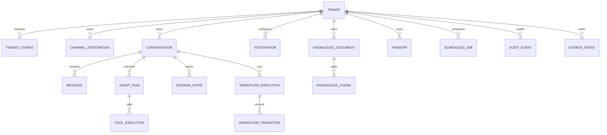

# Modelo de datos

**Estado:** ready  
**Fuente:** TDD-SYS-001

## Principios

- UUIDs no secuenciales como identificadores públicos.
- `tenant_id` obligatorio en toda entidad tenant-scoped.
- Foreign keys y uniques incluyen tenant cuando cruzan entidades tenant-scoped.
- Timestamps UTC (`timestamptz`) y conversión sólo en bordes.
- Configuración y contratos declaran `schema_version`.
- Payloads sensibles se minimizan, cifran o referencian.
- Auditoría append-only; datos de negocio se actualizan mediante reglas del owner.

## Diagrama

## Entidades

### Tenant

| Campo | Tipo | Regla |
|---|---|---|
| `id` | UUID | PK |
| `slug` | varchar(80) | único global, formato estable |
| `status` | enum | `provisioning`, `active`, `suspended`, `disabled` |
| `active_config_version` | integer nullable | FK compuesta a TenantConfig |
| `created_at`, `updated_at` | timestamptz | UTC |

### TenantConfig

| Campo | Tipo | Regla |
|---|---|---|
| `tenant_id` | UUID | parte de PK |
| `version` | integer | parte de PK, positivo |
| `schema_version` | integer | migración del documento |
| `status` | enum | `draft`, `validated`, `published`, `retired` |
| `payload` | jsonb | validado por Pydantic |
| `content_hash` | char(64) | integridad y dedupe |
| `created_by` | UUID | principal administrativo |
| `created_at`, `published_at` | timestamptz | publicación inmutable |

No contiene secretos. `credentials_reference` es un identificador opaco validado por policy.

### ChannelIntegration

| Campo | Tipo | Regla |
|---|---|---|
| `id`, `tenant_id` | UUID | unique compuesto |
| `channel` | enum | `simulated`, `whatsapp` |
| `external_account_id` | varchar | unique por channel |
| `secret_reference` | varchar | no sensible por sí mismo |
| `status` | enum | active/disabled |

Este mapping es la autoridad para resolver tenant desde mensajes entrantes.

### Conversation

| Campo | Tipo | Regla |
|---|---|---|
| `id`, `tenant_id` | UUID | PK y scope |
| `channel_integration_id` | UUID | FK con tenant |
| `external_user_ref` | text cifrado/tokenizado | nunca label de métrica |
| `status` | enum | `bot_owned`, `human_owned`, `closed` |
| `last_message_at` | timestamptz | ordenamiento |
| `lock_version` | integer | optimistic concurrency |

### Message

| Campo | Tipo | Regla |
|---|---|---|
| `id`, `tenant_id`, `conversation_id` | UUID | FKs compuestas |
| `direction` | enum | inbound/outbound |
| `external_message_id` | varchar | unique por channel integration |
| `content` | text/jsonb cifrable | retención separada |
| `content_type` | enum | text/document/interactive/system |
| `occurred_at`, `received_at` | timestamptz | reloj externo/interno |
| `dedupe_hash` | char(64) | duplicados |

### SessionState

| Campo | Tipo | Regla |
|---|---|---|
| `tenant_id`, `conversation_id` | UUID | PK compuesta |
| `active_skill` | varchar nullable | validada contra config |
| `active_workflow_id` | UUID nullable | FK con tenant |
| `compacted_memory` | text/jsonb | minimizada |
| `state_version` | integer | CAS |
| `expires_at` | timestamptz nullable | política de retención |

### AgentRun

| Campo | Tipo | Regla |
|---|---|---|
| `id`, `tenant_id`, `conversation_id` | UUID | correlación |
| `config_version` | integer | snapshot |
| `input_message_id` | UUID | trigger |
| `model_provider`, `model_name` | varchar | metadata, no prompt |
| `skill`, `workflow_type`, `mcp_server_id` | varchar nullable | trayectoria |
| `status` | enum | started/succeeded/failed/handed_off |
| `usage` | jsonb | tokens/costo normalizados |
| `started_at`, `finished_at` | timestamptz | latencia |
| `error_code` | varchar nullable | taxonomía común |

### ToolExecution

| Campo | Tipo | Regla |
|---|---|---|
| `id`, `tenant_id`, `run_id` | UUID | FKs compuestas |
| `tool_name`, `mcp_server_id` | varchar | allowlist auditada |
| `idempotency_key_hash` | char(64) nullable | no guardar token crudo |
| `request_summary`, `response_summary` | jsonb | sanitizados |
| `status`, `error_code` | varchar | resultado tipado |
| `started_at`, `finished_at` | timestamptz | latencia |

### Integration

| Campo | Tipo | Regla |
|---|---|---|
| `id`, `tenant_id` | UUID | PK/scope |
| `kind` | enum | mcp/channel/handoff/storage |
| `server_id`, `endpoint` | varchar | endpoint validado por allowlist de red |
| `credentials_reference` | varchar | secret manager |
| `capabilities` | jsonb | catálogo validado |
| `status` | enum | active/disabled |

### KnowledgeDocument y KnowledgeChunk

`KnowledgeDocument`: tenant, id, logical_name, source object key, mime type, checksum, version, status, classification, metadata permitida y timestamps.

`KnowledgeChunk`: tenant, document id/version, chunk id, ordinal, text sanitizado, token count, embedding, embedding model/version y metadata de citación.

Unique y foreign keys incluyen tenant. La query vectorial filtra tenant y `published` antes del ranking.

### WorkflowExecution y WorkflowTransition

`WorkflowExecution`: tenant, id, conversation, type, schema version, state, status, data JSON validado, idempotency key hash, lock version, timestamps y error.

`WorkflowTransition`: tenant, workflow, sequence, from/to state, command id, event type, sanitized payload, actor, run id y timestamp. Es append-only.

### Handoff

Tenant, id, conversation, workflow opcional, reason code, summary estructurado, external case reference, status, requested/accepted/resolved timestamps y owner reference.

### ScheduledJob

Tenant, id, type, payload versionado, business key, scheduled time, status, attempts, lock owner/expiry, last error y timestamps. Unique por `(tenant_id, type, business_key)`.

### OutboxEvent

Tenant, id, aggregate type/id, event type, payload versionado, occurred time, publish status, attempts y next attempt. Se escribe en la misma transacción que la mutación.

### AuditEvent

Tenant, id, run/conversation/workflow/tool refs opcionales, actor type/ref, action, resource type/ref, outcome, reason code, sanitized metadata, correlation id y timestamp. Append-only y particionable por tiempo.

## Persistente versus efímero

| Información | Clasificación |
|---|---|
| Tenant, config, integraciones | Persistente |
| Conversación, mensajes, session state | Persistente con retención |
| AgentRun, ToolExecution, AuditEvent | Persistente con retención/auditoría |
| Workflows, transitions, jobs, outbox | Persistente y durable |
| Documentos, chunks, embeddings | Persistente/versionado |
| CompiledContext | Efímero; no guardar prompt completo por defecto |
| Locks y cachés Redis | Efímero/reconstruible |
| Secret values | Secret manager; nunca base de aplicación |

## Controles de base de datos

- constraints compuestas `(tenant_id, id)`;
- índices comienzan por `tenant_id` en tablas tenant-scoped;
- transacciones fijan tenant de sesión para defensa en profundidad;
- Row Level Security evaluada y habilitada para paths administrativos o de alto riesgo;
- roles de DB separados para runtime, migración y auditoría;
- tests inspeccionan SQL y acceso cruzado;
- migraciones expand/contract y rollback lógico.

## Retención y borrado

Las políticas finales dependen de `EXT-006`. El diseño permite retención por clase: contenido de mensajes, documentos, estado, auditoría y telemetría. Un borrado autorizado elimina o anonimiza datos de negocio conservando el mínimo registro de auditoría legalmente requerido, definido por política aprobada.

