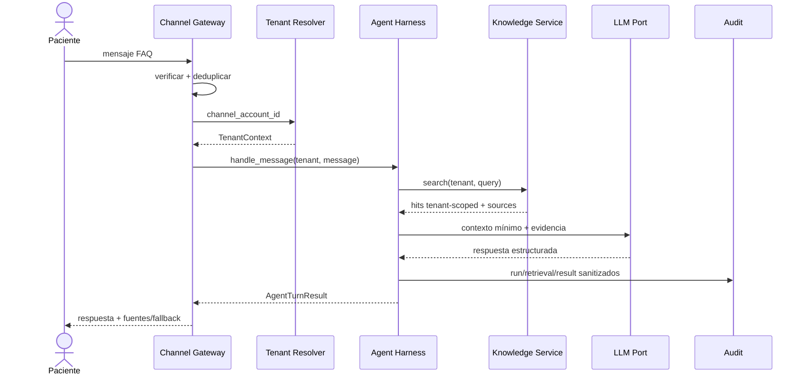
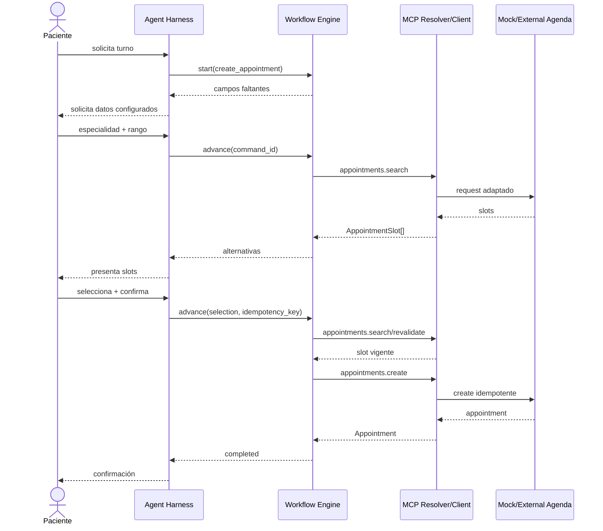
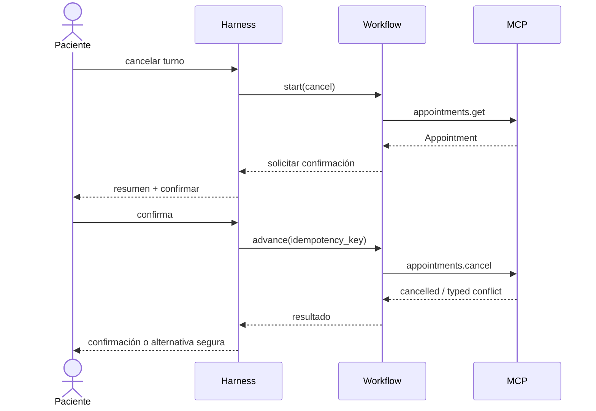
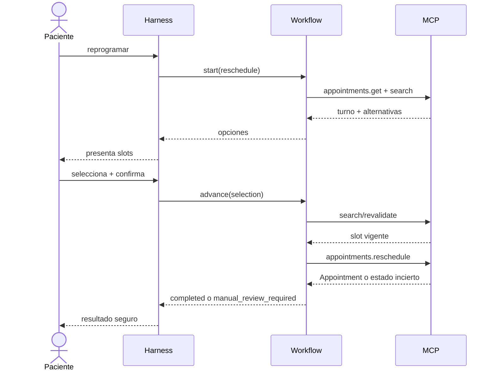
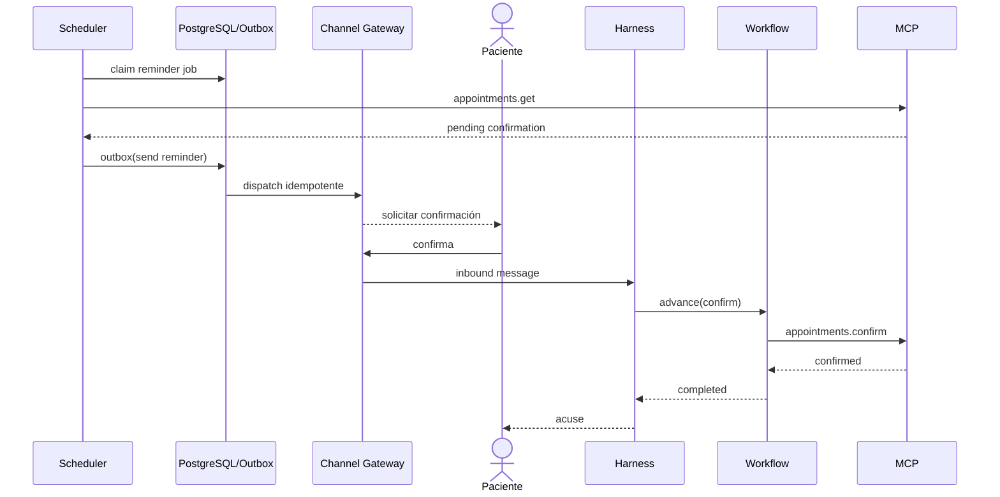
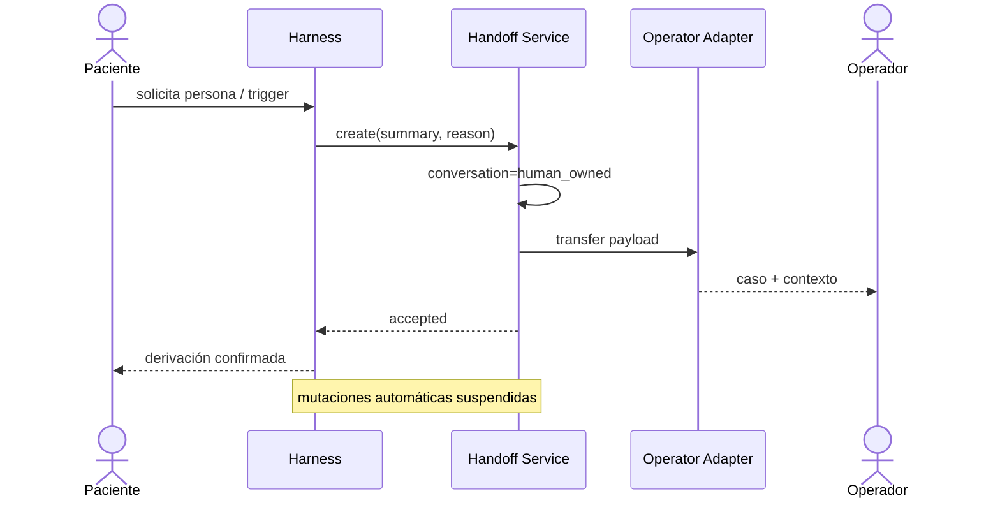
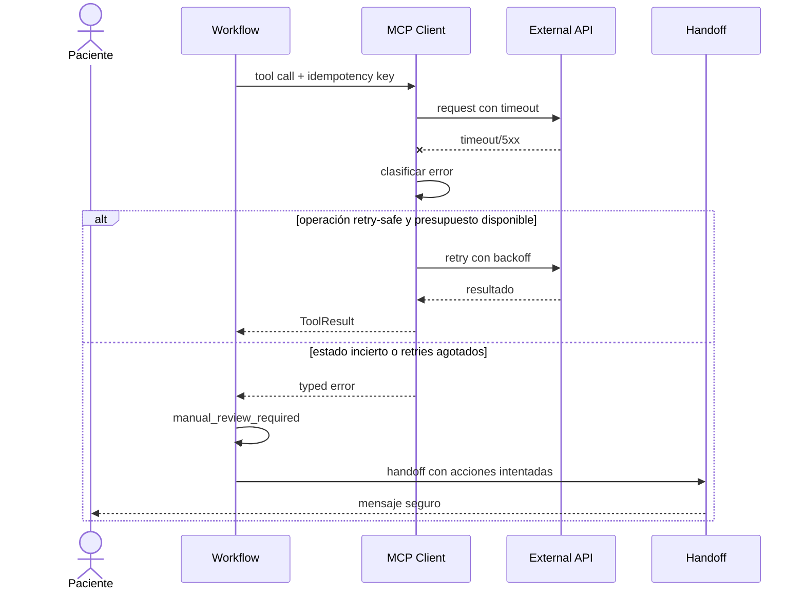

# Diagramas de secuencia

**Estado:** ready

## Consulta informativa

## Crear turno

## Cancelar turno

## Reprogramar turno

## Confirmación automática

## Human handoff

## Error del sistema externo

## Propiedades comunes

- Todas las llamadas llevan tenant y correlation/run id.
- Toda mutación lleva command id e idempotency key.
- Cada boundary valida contratos y sanitiza observabilidad.
- Una respuesta externa inválida produce `contract_violation`; no se entrega al modelo como datos confiables.

