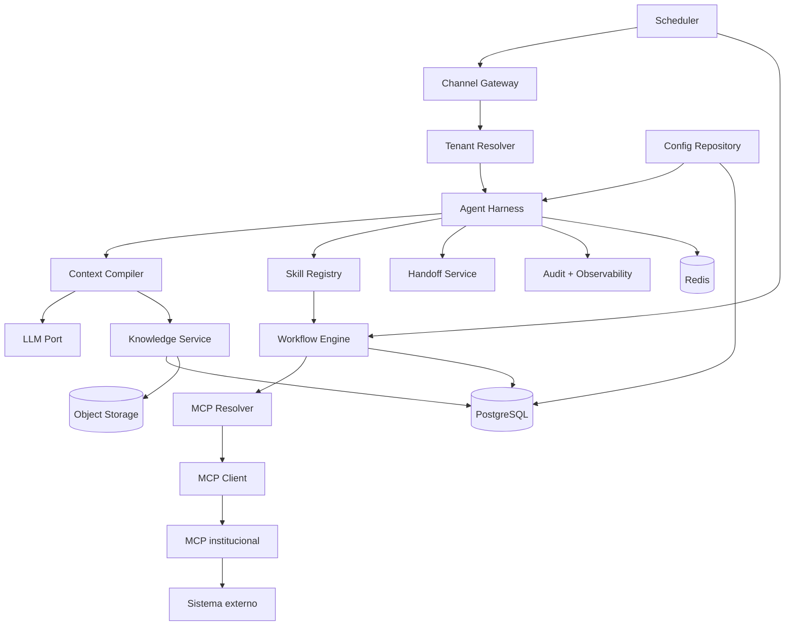

# TDD del sistema — Plataforma de agentes médicos multi-tenant

**ID:** TDD-SYS-001  
**Estado:** ready  
**Requisitos:** RF-001–RF-045, RNF-001–RNF-015  
**ADRs:** ADR-001–ADR-004

## 1. Contexto

La plataforma debe ofrecer agentes conversacionales reutilizando un Core común entre instituciones médicas. Cada institución mantiene configuración, conocimiento, políticas, credenciales, integraciones, MCP y capacidades aisladas. El primer MVP utiliza un canal WhatsApp simulado, PDFs institucionales, workflows de turnos, handoff y recordatorios.

## 2. Objetivos

- Incorporar tenants principalmente mediante configuración, conocimiento e integración.
- Evitar cualquier fuga de datos o capacidades entre tenants.
- Separar decisiones probabilísticas del LLM de operaciones transaccionales.
- Mantener proveedores y sistemas externos detrás de puertos reemplazables.
- Implementar incrementos end-to-end verificables.
- Reconstruir cada ejecución con auditoría estructurada.

## 3. No objetivos

- Microservicios independientes para cada módulo durante el MVP.
- Proveedor cloud, LLM, WhatsApp o handoff definitivo.
- Diagnóstico médico o decisión clínica.
- Reemplazar los sistemas institucionales de registro.
- Inventar contratos de una API externa no documentada.
- Declarar cumplimiento regulatorio sin revisión especializada.

## 4. Arquitectura



La aplicación es un monolito modular. API, worker y MCP pueden ejecutarse como procesos separados usando los mismos paquetes. Los límites lógicos no dependen de que el despliegue sea único.

## 5. Contexto de tenant

La identidad autenticada y el contexto de ejecución son tipos distintos. `TenantIdentity` se crea después de autenticar el envelope; todavía no autoriza acceso a datos de conversación o negocio:

```python
@dataclass(frozen=True, slots=True)
class TenantIdentity:
    tenant_id: UUID
    tenant_slug: str
```

Las operaciones administrativas usan un contexto separado y autorizado:

```python
@dataclass(frozen=True, slots=True)
class TenantAdminContext:
    identity: TenantIdentity
    principal_id: UUID
    roles: frozenset[str]
    correlation_id: UUID
```

`TenantContext` se crea únicamente después de capturar atómicamente la configuración activa:

```python
@dataclass(frozen=True, slots=True)
class TenantContext:
    tenant_id: UUID
    tenant_slug: str
    config_version: int
    correlation_id: UUID
```

Reglas:

- ninguno de los dos tipos se crea desde texto enviado por el paciente;
- `TenantIdentity` sólo puede usarse para capturar configuración activa y resolver el mapping autenticado inicial; mutaciones administrativas exigen `TenantAdminContext`;
- todos los repositorios y servicios de conversación, knowledge, workflows, MCP, handoff, scheduling y auditoría exigen `TenantContext`;
- `TenantContext` se pasa explícitamente a repositorios, servicios, retrieval, workflows, MCP y auditoría;
- ninguna API interna sensible acepta un tenant opcional;
- el tenant de una entidad se valida contra el contexto antes de leer o mutar;
- jobs serializan `tenant_id` y vuelven a resolver configuración autorizada;
- logs pueden registrar el identificador opaco, no contenido sensible.

## 6. Configuración versionada

Una configuración publicada es inmutable. La activación cambia el puntero `active_config_version` del tenant dentro de una transacción. Una ejecución captura la versión al comenzar y no cambia de configuración a mitad del run.

```python
class TenantConfig(BaseModel):
    schema_version: Literal[1]
    tenant_id: UUID
    version: PositiveInt
    agent: AgentConfig
    enabled_skills: frozenset[SkillName]
    appointments: AppointmentPolicy
    knowledge: KnowledgeConfig
    mcp: McpConfig
    handoff: HandoffPolicy
    feature_flags: Mapping[str, bool]
```

La configuración contiene referencias a secretos, nunca valores. La validación rechaza tools que no pertenezcan a skills habilitadas y namespaces que no correspondan al tenant.

## 7. Flujo de ejecución del agente

1. Channel Gateway verifica autenticidad, normaliza el mensaje y genera `message_id`.
2. Tenant Resolver deriva un `TenantIdentity` desde la integración/canal autenticado.
3. Configuration Service captura payload y versión activa en una lectura consistente y crea el `TenantContext` inmutable.
4. Conversation Service carga o crea conversación usando `TenantContext` y aplica deduplicación.
5. Agent Harness crea `run_id`, estado y traza raíz usando el mismo contexto.
6. Intent Router selecciona una skill permitida o fallback.
7. Context Compiler arma un contexto mínimo con políticas, memoria relevante, retrieval y tools allowlisted.
8. LLM Port produce respuesta estructurada o propuesta de tool/workflow.
9. Consultas informativas vuelven con fuentes y política de insuficiencia.
10. Mutaciones se entregan al Workflow Engine; el LLM no llama directamente al adapter.
11. Resultado, tool calls, métricas y auditoría se persisten.
12. Channel Gateway entrega respuesta con clave de deduplicación.

Una activación concurrente puede cambiar la versión para ejecuciones posteriores, pero nunca muta el `TenantContext` ya creado.

## 8. Agent Harness

Interfaz pública:

```python
class AgentHarness(Protocol):
    async def handle_message(
        self,
        tenant: TenantContext,
        message: InboundMessage,
    ) -> AgentTurnResult: ...
```

Responsabilidades:

- ciclo de run y correlación;
- carga de configuración y conversación;
- skill routing;
- compilación de contexto;
- interacción con LLM;
- dispatch a knowledge/workflow/handoff;
- persistencia de resultados;
- auditoría y manejo seguro de errores.

No contiene reglas de una institución, SQL, SDKs externos ni secretos.

## 9. Context Compiler

```python
class ContextCompiler(Protocol):
    async def compile(
        self,
        tenant: TenantContext,
        request: ContextRequest,
    ) -> CompiledContext: ...
```

El compiler recibe una skill ya autorizada. Incluye sólo:

- instrucciones Core versionadas;
- políticas de tenant necesarias para la skill;
- estado del workflow actual;
- historial reciente acotado;
- memoria compactada pertinente;
- chunks recuperados con procedencia;
- tools de la skill intersectadas con allowlist del tenant.

Las credenciales, configuración completa, otros namespaces, payloads crudos de API y eventos de auditoría no ingresan al prompt.

## 10. Skills

```python
class Skill(Protocol):
    name: SkillName

    def required_fields(self, config: TenantConfig) -> tuple[FieldSpec, ...]: ...
    def allowed_tools(self, config: TenantConfig) -> frozenset[ToolName]: ...
    async def route(self, turn: SkillTurn) -> SkillResult: ...
```

MVP:

- `faq`: retrieval y respuesta informativa;
- `appointments`: inicia/continúa workflows de turnos;
- `human_handoff`: crea transferencia estructurada.

Skill Registry falla cerrado: una skill desconocida o deshabilitada no se instancia y sus tools no aparecen en contexto.

## 11. Knowledge Service

Puertos:

```python
class KnowledgeService(Protocol):
    async def search(
        self,
        tenant: TenantContext,
        query: KnowledgeQuery,
    ) -> tuple[KnowledgeHit, ...]: ...

class KnowledgeIngestor(Protocol):
    async def ingest(
        self,
        tenant: TenantContext,
        document: DocumentSource,
    ) -> IngestionResult: ...
```

Todo registro de documento, chunk y embedding incluye `tenant_id`, `document_version` y estado. Retrieval aplica tenant en la query SQL, namespace vectorial y validación post-query. Sólo versiones `published` participan del entorno activo.

La respuesta informativa incluye `source_ids`, nivel de soporte y fallback. Si ningún hit supera la política configurada, se prohíbe presentar datos institucionales no sustentados.

## 12. Workflow Engine

```python
class WorkflowEngine(Protocol):
    async def start(
        self,
        tenant: TenantContext,
        command: StartWorkflow,
    ) -> WorkflowResult: ...

    async def advance(
        self,
        tenant: TenantContext,
        command: AdvanceWorkflow,
    ) -> WorkflowResult: ...
```

Propiedades:

- estado persistente y versionado;
- transición por compare-and-swap;
- command id e idempotency key;
- validación de precondiciones;
- side effects mediante outbox;
- retry sólo en errores tipados como transitorios y operaciones seguras;
- compensación o estado `manual_review_required` cuando no existe rollback seguro;
- confirmación explícita antes de mutaciones configuradas como sensibles.

Estados base de un workflow: `collecting`, `awaiting_confirmation`, `executing`, `completed`, `failed`, `manual_review_required`, `cancelled`.

## 13. MCP Platform

El MCP Resolver implementa:

```python
class McpResolver(Protocol):
    async def resolve(
        self,
        tenant: TenantContext,
        capability: CapabilityName,
    ) -> McpTarget: ...
```

`McpTarget` contiene server id, endpoint interno, auth reference y tools permitidas. El auth reference se resuelve dentro del transporte/adapter, no se devuelve al modelo.

Los MCPs institucionales reutilizan:

- autenticación y secret resolution;
- schemas canónicos;
- tool registry;
- errores;
- tracing y audit hooks;
- políticas de timeout/retry;
- contract test suite.

El adaptador institucional sólo transforma y aplica particularidades confirmadas de su API.

## 14. Channel Gateway

```python
class ChannelAdapter(Protocol):
    async def verify_and_parse(self, request: RawChannelRequest) -> InboundMessage: ...
    async def send(self, tenant: TenantContext, message: OutboundMessage) -> DeliveryResult: ...
```

`InboundMessage` contiene `channel`, `channel_account_id`, `external_message_id`, `external_user_id`, timestamp, contenido normalizado y metadata permitida. La combinación canal/cuenta resuelve tenant; el usuario no puede sobrescribirla.

El adapter simulado existe sólo en `test`/`development`. La identidad de cuenta viaja fuera del body de usuario en headers firmados con HMAC de entorno de prueba (`account`, `timestamp`, hash del body); firma, freshness y replay se validan antes de construir `InboundMessage`. No se monta esa ruta en producción.

## 15. Handoff

```python
class HandoffService(Protocol):
    async def create(
        self,
        tenant: TenantContext,
        request: HandoffRequest,
    ) -> HandoffResult: ...
```

El resumen contiene identificador de paciente permitido, motivo, información recolectada, acciones, estado de workflow y razón de transferencia. Al activarse, la conversación queda `human_owned`; el runtime puede acusar recibo, pero no iniciar mutaciones hasta una reanudación autorizada.

## 16. Scheduling

Los recordatorios son jobs determinísticos persistidos. La identidad estable es `(tenant_id, appointment_id, reminder_kind)`. `scheduled_for` y `schedule_version` son atributos mutables: una reprogramación reemplaza la fecha, incrementa versión y vuelve obsoleta cualquier entrega reclamada con una versión anterior. El worker verifica versión y estado vigente antes de enviar y usa outbox para evitar separación entre commit y entrega.

El reloj es una dependencia inyectable para pruebas. La respuesta al recordatorio reingresa por Channel Gateway y continúa un workflow de confirmación.

## 17. Persistencia y consistencia

- PostgreSQL es autoritativo para tenant, configuración, conversación, workflows, auditoría y outbox.
- Redis acelera y coordina; una pérdida de Redis no elimina estado de negocio.
- pgvector vive en PostgreSQL inicialmente y se accede mediante `KnowledgeRepository`.
- Documentos originales se almacenan por key con prefijo opaco de tenant y metadata en PostgreSQL.
- Mutación de negocio y evento outbox comparten transacción local.
- Integraciones remotas usan idempotency key o deduplicación propia cuando la API lo permite.

## 18. Errores

Taxonomía común:

| Código | Retry | Exposición al usuario |
|---|---|---|
| `validation_error` | no | Solicitar corrección segura |
| `unauthorized` | no | Mensaje genérico + auditoría |
| `forbidden` | no | Acción no permitida o handoff |
| `not_found` | no | Mensaje contextual sin fuga |
| `conflict` | depende | Revalidar estado |
| `rate_limited` | sí con backoff | Demora o handoff |
| `upstream_timeout` | sí si seguro | Reintento acotado |
| `upstream_unavailable` | sí si seguro | Degradación/handoff |
| `contract_violation` | no | Error interno + alerta |
| `tenant_isolation_violation` | no | Abort, alerta crítica y auditoría |

Mensajes externos nunca incluyen stack traces, endpoints internos, secretos ni existencia de recursos de otro tenant.

## 19. Seguridad y privacidad

- autenticación de channel accounts y APIs administrativas;
- autorización por rol y tenant;
- queries tenant-scoped y constraints compuestas;
- secret manager y referencias opacas;
- cifrado en tránsito y reposo;
- minimización de prompt, logs y traces;
- redacción centralizada;
- protección contra prompt injection en contenido recuperado;
- allowlist de tools independiente de instrucciones del modelo;
- auditoría de acceso y cambios de configuración;
- retención configurable y borrado controlado.

El detalle se encuentra en `security-and-multitenancy.md`.

## 20. Observabilidad

Cada run genera trace raíz y atributos de baja cardinalidad: `run_id`, `tenant_id`, `config_version`, `skill`, `workflow_type`, `mcp_server_id`, estado y error code. Conversation IDs y patient identifiers no se usan como etiquetas de métricas.

La auditoría estructurada es independiente de logs operativos y tiene controles de acceso y retención propios.

## 21. Despliegue

Procesos iniciales:

- `api`: FastAPI, stateless;
- `worker`: outbox, jobs, ingestión y scheduler;
- `mcp-<tenant>`: uno o más procesos configurados por institución;
- PostgreSQL, Redis y object storage.

Health checks separan liveness de readiness. Una dependencia no esencial degradada no reinicia en loop toda la plataforma; readiness declara la capacidad afectada.

## 22. Rollout y rollback

- migraciones expand/contract para cambios compatibles;
- configuración publicada mediante version nueva y activación atómica;
- feature flags por tenant;
- activación de integraciones reales por allowlist;
- rollback de config y despliegue sin borrar auditoría;
- jobs antiguos conservan versión de payload y handler compatible durante la ventana de migración.

## 23. Estrategia de testing

Unitarios, contrato, integración, E2E, aislamiento, seguridad, resiliencia, evals y performance se definen en `testing-strategy.md`. Toda mutación tiene tests de replay y duplicado; todo repositorio tenant-scoped tiene tests de acceso cruzado.

## 24. Riesgos

| Riesgo | Control |
|---|---|
| Contexto incorrecto | Tenant resuelto antes del runtime y pasado explícitamente |
| Doble mutación | Idempotency key, CAS y outbox |
| Tool no autorizada | Intersección skill/config/servidor y falla cerrada |
| Documento malicioso | Contenido tratado como datos, no instrucciones |
| Adapter incompatible | Contract tests y error `contract_violation` |
| Dependencia lenta | Timeout budgets, circuit policy y handoff |
| Config cambia en un run | Snapshot por `config_version` |

## 25. Criterio de aprobación

- responsabilidades sin solapamientos críticos;
- tenant obligatorio en todos los puertos sensibles;
- mutaciones gobernadas por workflows;
- contratos de proveedores aislados;
- estado autoritativo persistente;
- errores y observabilidad comunes;
- slices del roadmap implementables sin redefinir arquitectura.
